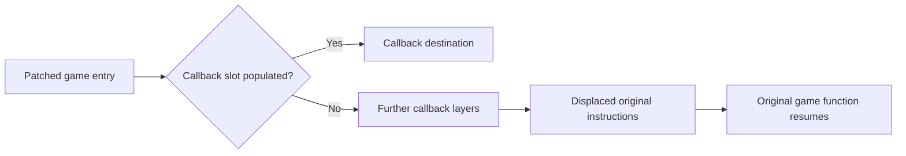

# Static reverse-engineering findings - 2026-09-27

The main modifications are concentrated in the added Monite library and the outer Unity engine. Several other nonmatching files are signing or distribution changes. This pass identifies concrete instruction changes and callback behavior; it does not recover Monite's complete source or establish working gameplay.

## Compared inputs and exact count

Inputs were the original supplied outer ZIP and its nested `monite.zip`, not a subsequently generated Zucchini IPA. Directory entries were excluded and the outer `Payload/FreeFire.app/` prefix was normalized. All common files were compared with SHA-256.

| Category | Count | Result |
| --- | ---: | --- |
| Identical common files | 3,276 | SHA-256 matches, including game metadata |
| Changed common files | 6 | Listed below |
| Outer-only files | 3 | Monite library, ESign marker, nested archive |
| Nested-only files | 8 | `FreeFire2` and seven `SC_Info` files |

This gives **17 nonmatching file paths** with additions/removals counted individually. A count of 13 cannot be reconciled without that comparison's path list and exclusions. It should not be assumed that every nonmatching file contains cheat logic.

## File classification

| File or group | Verified observation | Meaning and limit |
| --- | --- | --- |
| `Frameworks/UnityFramework.framework/UnityFramework` | Executable instructions changed; added hook/Monite sections | Contains actual prior runtime modifications |
| `Frameworks/Monite.dylib` (outer only) | Added arm64 library with UIKit dependencies, six initializer offsets, custom `.vlizer`, `__CV`, and `__VDATA` segments | Original menu/runtime implementation is a primary investigation target; private feature logic remains unrecovered |
| `FreeFire` | Outer launcher adds a load command for `@executable_path/Frameworks/Monite.dylib` | Explains why our replacement uses this filename; nested executable declares encryption, so raw code differences cannot all be attributed to menu patches |
| `Frameworks/DataDomeSDK.framework/DataDomeSDK` | All 12,252 differing bytes fall inside its declared code-signature blob; executable/data sections match | No executable-code change found in this binary pair |
| `Info.plist` | Minimum iOS changed from 15.0 to 10.0, file/document sharing enabled, supported-device list removed | Packaging configuration differences; not aiming logic |
| `_CodeSignature/CodeResources` | Resource-signing inventory differs | Outer inventory includes the added library, ESign marker, and archive; signing metadata is not feature source |
| `Frameworks/UnityFramework.framework/_CodeSignature/CodeResources` | Signing-resource entries differ | Compared payload resources remain hash-identical despite metadata representation differences |
| `SignedByEsign` (outer only) | Distribution marker | Not evidence of aiming implementation |
| `monite.zip` (outer only) | Full nested application-tree archive | Comparison reference; runtime purpose still unverified, so retained |
| `FreeFire2` (nested only) | Second compiled launcher with encryption declared | Its purpose and runtime usage are unresolved |
| Seven nested-only `SC_Info` files | Supplementary files/manifest accompanying the nested application | Their names/location indicate store/distribution metadata; no aiming implementation was established there |

The seven `SC_Info` paths are `FreeFire.sinf`, `FreeFire.supf`, `FreeFire.supp`, `FreeFire.supx`, `FreeFire.v4.supp`, `FreeFire.v5.supf`, and `Manifest.plist`.

## Unity instruction changes

Corresponding existing code sections contain **97 changed four-byte ARM64 instruction words**. Nearby changes were grouped for reporting, producing 92 groups: 69 in ordinary code, 15 in imported-function stubs, and eight in Objective-C message stubs. These group counts differ from counts of individual redirects because adjacent imported stubs can share a group.

Disassembly identified **92 redirection sites plus two direct early-return edits**:

- 67 redirections in ordinary executable code, including 12 recovered managed-function entries and numerous native call sites. Fifty replaced instructions were system-call instructions. Their ultimate purpose is not established by this mechanical observation.
- 17 redirected imported functions spanning file access, directory enumeration, loaded-image inspection, process/system information, and hashing. The existence of wrappers does not establish what their active callbacks return.
- Eight redirected Objective-C message stubs. Seven cover file or OS/bundle information. The eighth redirects `UTF8String` through a separate helper with null checks and message calls.
- Two native locations were changed to return early. Their high-level roles remain unidentified. These instruction changes remain present even when the menu library is replaced.

Twelve patched entries map exactly to recovered managed method starts. Readable examples include map-marker updates, guest-reset configuration, weapon-swap cooldown, free movement, regional blood settings, medikit-rate access, and 120 FPS availability. Other names are obfuscated. These are **hook entry points**, not proof that those features are enabled or that we recovered their callback algorithms.

## Callback fallback analysis

Of 92 redirection sites, **91 start with a nullable callback slot and a zero-value fallback path**. Each entry slot contains zero in the supplied file. The remaining site is the separate `UTF8String` helper.

Using only on-disk values, a bounded static walk followed 89 fallback paths back into the original code section. Two walks stopped at indirect calls whose targets the walker does not model. No game instructions, system calls, or stack operations were executed; the walker records displaced instructions and follows constant branch scaffolding only.

All **12 managed-function hooks** have three callback layers. For each, the static zero-callback path reproduces the displaced instructions and resumes at the exact original instruction following the patch. All 12 comparisons passed.

This narrows the earlier concern: these sites do not inherently jump through a null pointer merely because the old library is absent. It does **not** prove device stability. Runtime initialization could change slots, indirect calls remain unresolved, and the direct return edits and helper still exist.

## Relevance to Zucchini

The following six game methods used by our adapter were compared over their complete function-start ranges and are byte-identical between the nested and outer Unity binaries:

- `GameFacade.CurrentMatch`
- `GameFacade.CurrentLocalPlayer`
- `GameFacade.IsLocalTeammate(Player)`
- `Player.get_HeadBoneTransform`
- `Player.get_NeckBone`
- `Player.SetAimRotation`

That supports the chosen integration points as being separate from the identified static patches. It does not verify invocation semantics, callers/callees, camera behavior, or frame timing on an iPhone.

The original Monite library contains a large visible crypto-library symbol set, startup code outside its ordinary text section, and nonstandard segments. A simple symbol lookup does not expose an original aimbot implementation. Six initializer offsets were recovered from `__init_offsets`; the absence of `__mod_init_func` does not mean the library has no startup code. No normal Objective-C class-list section was found. We have not reconstructed its private aiming callbacks or established whether/how it uses the nested archive.

No callback hooks, existing protection-related changes, original menu code, or binary patches were copied into Zucchini. This pass changes analysis documentation only; the current IPA remains the resource-preserving experimental build.

## Evidence and reproducibility

Local analysis tools and disassembly remain outside Git:

- `../analysis/reverse_differences.py`: hashes archive entries, parses Mach-O structures, disassembles changed instruction ranges, and matches managed method starts.
- `../analysis/trace_legacy_hooks.py`: classifies signatures/plists and records initial callback scaffolding.
- `../analysis/check_zero_callback_paths.py`: bounded static branch walk, not a general CPU emulator.
- `../analysis/reverse-differences/inventory.json`: exact file paths, sizes, and hashes.
- `../analysis/reverse-differences/unity-patches.json`: instruction differences and recovered names.
- `../analysis/reverse-differences/followup.json`: callback slots, signature classification, and configuration comparison.
- `../analysis/reverse-differences/zero-callback-paths.json` and `managed-fallback-checks.json`: static fallback checks and their limits.
- `../analysis/reverse-differences/zucchini-method-comparison.json`: adapter method comparisons.
- `../analysis/reverse-differences/monite-overview.json`, `monite-symbols.json`, and `monite-initializers.json`: original-library structure and startup observations.

Mach-O parsing follows [Apple's loader definitions](https://github.com/apple-oss-distributions/xnu/blob/main/EXTERNAL_HEADERS/mach-o/loader.h). ARM64 disassembly uses an isolated local Capstone 5.0.6 installation and its [Python interface](https://www.capstone-engine.org/lang_python.html). Neither supplied binary was executed or modified. Proprietary binaries, disassembly, and credentials were not uploaded to GitHub.

## Subsequent aiming analysis

The symbol-only limit above was superseded by a deeper static pass: [MONITE-AIMING.md](MONITE-AIMING.md) records chained imports, decoded configuration strings, screen-based selection and quaternion interpolation. It remains a partial reconstruction, not recovered source or verified device behavior.
