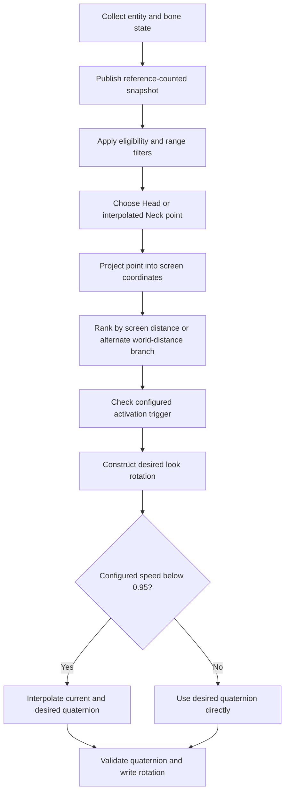

# Original aiming analysis and tracking revision

Inspected locally on 2026-09-27. Input is the original supplied `Monite.dylib`, SHA-256 `b64d66b7df7ef7692914e293029d1fefede168eb0cdd6852d9d8051073d2d430`. Addresses below are unslid library virtual addresses, not offsets to copy into a runtime. This is a partial reconstruction from compiled code, not recovered source or an execution trace.

## What was recovered

The library uses chained imports. Decoding those records resolved all **444 import stubs**, with 816 bound slots and 27,428 rebase records. This corrected an earlier generic symbol-mapping limitation and made the math and memory-call paths identifiable. Parsing follows Apple's [chained-fixup definitions](https://github.com/apple-oss-distributions/dyld/blob/main/include/mach-o/fixup-chains.h).

String transforms were reconstructed statically: four byte-operation variants combine rotations, arithmetic, XOR and a substitution table. The varying seed/branch scaffolding converges on the same transform within each variant. The scanner recognized **1,923 decoder functions** and recovered readable strings at **1,498 direct call sites**. Those counts include repeated labels and non-game strings; they are not feature counts. Indirect calls and non-ASCII strings are not covered. No original code was loaded or run.

### Archive identity and snapshot producer

The full ZIP in `C:\Users\Mayank\Downloads\1790249576134-up31b8suvge-Free_Fire_1.132.1_1790249070.zip` contains 3,286 entries. Its original library matches the SHA-256 above; it is the same version as the workspace input, not a second implementation. No separate IPA was found on Desktop. The owner's follow-up identified Downloads as the probable location.

The producer at `0xbd064c` is now traced through snapshot publication. It builds **208-byte candidate records** independently of the consuming selection pass. Accessor `0xbd49ac` copies a reference-counted snapshot under mutex `0xf9a890`; the producer publishes the replacement through `0xf9a8d8` under that same mutex at `0xbd1378`–`0xbd139c`. It increments a generation counter at `0xbd1350`–`0xbd1364`. This prevents the consumer from reading a vector while the producer replaces that vector; it does not establish that every game field was sampled simultaneously.

The producer calls `sleepForTimeInterval:` through `0xc6ef60` at `0xbd06e0`. Its selector reference `0xf7ce88` resolves to that exact Objective-C selector. The active loop loads **0.016 seconds** from `0xca9470` and passes it via `0xbd0cd0`; an unavailable-state branch uses **0.03 seconds** from `0xca9478`. Collection time is additional, so this is not evidence of an exact 60 Hz sampling rate. Invalid prerequisites or missing match state clear the published snapshot.

| Record offset | Recovered producer/consumer relationship |
| --- | --- |
| `+0x00` | Entity pointer. |
| `+0x08` | Three-float root position, read through a transform chain. |
| `+0x14` | Point consumed by the Head UI case; producer uses helper `0xbd2ca4` with cached field offset at `0xfdcd60`. |
| `+0x20` | Point consumed by the Pelvis UI case; same helper with cached field offset at `0xfdcd68`. |
| `+0x2c` through `+0xa0` | Optional additional positions populated for drawing/other point choices. Their full named-bone mapping is unresolved. |
| `+0xa4`, `+0xa8` | Two values populated by `0xbd2e2c`; do not assume named health fields until the cached field table is resolved. |
| `+0xad` | Flag returned by `0xbd3230`, consumed by `ignore_knocked`. |
| `+0xae` | Flag read through cached field `0xfdcd28`, consumed by `ignore_bots`. |
| `+0xaf` | Unconditional rejection flag from a nested-reference check. Its named game state is unresolved. |
| `+0xb0` | Flag from `0xbd3510`, consumed by `only_visible`; defaults true when collection of this flag is disabled. |
| `+0xb4` | Euclidean distance from local reference position to candidate root, with a pelvis-point fallback when a root component is zero (`0xbd1a74`–`0xbd1af0`). |
| `+0xb8` | Optional converted name string, with normal short/long-string cleanup. |

The three filter associations are independently supported by decoded loader keys at `0xad6504`, `0xad6570`, `0xad65dc`, their stores at `0xad655c`, `0xad65c8`, `0xad6634`, and consuming branches at `0xbce3ec`–`0xbce428`. In particular, the original visibility helper reads nested state and two integers (`0xbd3510`); this path does **not** perform Zucchini's physics raycast. Equal configuration names therefore do not imply equal visibility behavior.

For successful reads of both integers, that helper returns `second == 1 ? first != 0 : first == -1` (`0xbd36b0`–`0xbd36cc`). Failure branches differ, so this expression describes only its successful-read path. The integers come from a nested object reached through the cached entity field at `0xfdcd38`, then cached offsets at `0xfdcde0` and `0xfdcde8`; their game field names are not established.

Bone helper `0xbd2ca4` follows the entity field and a second cached wrapper field, then calls `0xbd3934`. That helper checks the transform's native-object reference and invokes a cached function with the object and a three-float output buffer. This establishes the data flow, but the wrapper offsets and function's named runtime identity remain unresolved. It is not sufficient evidence to substitute guessed offsets into Zucchini.

### Selection and rotation path

| Evidence | Observed behavior |
| --- | --- |
| `0xbcc0b8`, `0xbcc170` onward | Clears the selected-target slot, obtains a snapshot and visits candidates. This path does not demonstrate persistent target locking. |
| `0xbce3ec`–`0xbce454` | Checks the bot/knocked/visibility-associated snapshot flags above, an additional rejection flag, and a distance limit. |
| `0xbce458`–`0xbce738` | Selects a point from a bone table, with multiple optional interpolated points and a zero-position fallback. The UI identifies Head=1, Neck=2, Chest=3, Pelvis=4; additional enum values remain only partly mapped. |
| `0xbce73c`–`0xbce7f8` | Projects the point, rejects nonfinite/behind-camera projections, and computes distance from screen center. In the default branch the FOV value is the initial screen-distance threshold; another priority branch minimizes a stored world-distance value. Do not equate this to a full angular cone. |
| `0xbce7fc`–`0xbce814` | Stores the chosen entity and world point for downstream aiming. |
| `0xbcd2b8` onward | Branches by trigger setting before the rotation path: Always=0, Firing=1, Scoped=2, Walking=3, Crouching=4. The named game fields/functions implementing every predicate are not fully resolved. |
| `0xbcf93c`, helper `0xbd4858` | Obtains an origin through a no-argument object getter, transform getter and position getter; falls back through `0xbd8fa8`. The primary chain is consistent with main-camera position, but the cached runtime addresses are not yet independently mapped to every named method. |
| `0xbcf990`–`0xbcfa40` | Rejects invalid/zero positions and target-origin distances below 0.1, then constructs a look quaternion from target minus origin with world-up `(0,1,0)`. Helpers: `0xbda944`, `0xbdaca0`. |
| `0xbcfa54`–`0xbcfac0` | Reads the aim-speed value. At **0.95 or higher**, uses the desired quaternion directly. Below that, obtains current rotation and blends toward the desired quaternion using a fraction clamped to **0.01–1**. |
| `0xbdaa28` | Normalized quaternion interpolation with a near-identical linear branch and sine/acos interpolation branch. No time-delta scaling is visible at its identified caller. |
| `0xbcfac4`–`0xbcfb14` | Checks quaternion finiteness and squared norm between 0.5 and 2 before writing. |
| `0xbdaba0`, `0xbdafa4` | Writes 16 bytes at a validated object plus a cached field offset. The destination field's exact identity remains unresolved. Zucchini does not copy this raw-write mechanism. |

The on-disk aim-speed value is **1.0**, which reaches the direct-rotation branch if it remains unchanged at runtime. The on-disk FOV value is 90; it can be changed by configuration.

The Neck mode is an interpolated point, not a direct neck-bone read: its UI maps to enum 2 (`0xb09ddc`/`0xac0298`), the jump table at `0xca9750` selects `0xbce484`, and helper `0xbdac70` computes `pelvis + 0.78 * (head - pelvis)` using the snapshot positions identified by the Head/Pelvis UI cases. Chest uses a separate 0.45 blend. This establishes a remaining difference from Zucchini's direct `get_NeckBone` target. The producer now links those positions to the cached fields above, but their runtime bone-object identities still need the unresolved field-table initialization.

Trigger enum order is supported by five decoded UI keys at `0xb0b7fc`–`0xb0b88c`, their ordered option array, and the zero-based index stored by the common dropdown at `0xb131d4`/`0xb132e0`. Always takes the unconditioned trigger branch; Firing calls a cached predicate, while the other modes read nested state or call state helpers. This recovers the UI meaning without inventing a method name for those predicates.

The speed association is supported by decoded `aim_speed` at `0xad6720`, its float store to `0xf9b4e4`, and the synchronization block at `0xad7fa8`–`0xad8050` copying that value to the rotation path's `0xf8546c`.

The supplied game's `Player.SetAimRotation` was also inspected. Its ordinary field-store branch writes four floats, while other branches dispatch through runtime overrides. A successful invocation is not proof the game kept that rotation through its subsequent updates. Zucchini continues to use the named method, not an inferred original field offset.

## Other features inventoried

The loader contains **67 distinct decoded configuration keys** in this recovered range. The following groups are supported by decoded configuration keys in the loader at `0xad6400`–`0xad8000` and related UI paths. They establish configuration presence, not complete or working algorithms.

| Group | Recovered settings/features | Recovery status |
| --- | --- | --- |
| Aim | Enable, FOV circle/radius, speed, distance, bone, priority, trigger, ignore bots/knocked/visibility | Producer, core record layout, selection, trigger enums and quaternion path traced above; cached field identities and additional bone enums incomplete. |
| Additional aim modes | Vectored, humanized/legit, silent, separate legit bone | Labels/configuration identified. Their complete alternate callbacks are not reconstructed. |
| Player visuals | Lines, boxes, health, names, distance, count/count size, skeleton, filters and range | Configuration plus drawing paths observed in the large update function; full rendering behavior not reconstructed. |
| World/item visuals | Vehicles, airdrops, weapons, vests, helmets, medkits | Configuration identified; complete object discovery and rendering paths not reconstructed. |
| Visual colors | Lines, boxes, names, FOV, skeleton, distance, counter, vehicles, airdrops, weapons, vests, helmets, medkits | Separate color keys and color/drawing arithmetic observed. |
| Weapon actions | No recoil, fast swap, fast reload, auto fire | Configuration identified; weapon-swap hook entry also mapped in the earlier binary-difference audit. Other algorithms unresolved. |
| Movement | Teleport, teleport mark, free move, float, spin/spin speed, AI telekill, backjump, speed/speed value | Configuration identified; free-movement and marker-related hook entries mapped previously. Complete algorithms unresolved. |
| Other | Fast medkit, regional blood, force 120 FPS, enemy visibility override, screen stretch, reset guest, instant loot | Configuration identified; medkit/blood/FPS/guest hook entries mapped previously. Runtime effectiveness untested. |

The earlier 12 managed-hook mappings and static fallback checks are in [BINARY-DIFFERENCES.md](BINARY-DIFFERENCES.md). This inventory does not establish that every configuration is exposed, enabled or functional in the supplied version. No additional gameplay feature was added to Zucchini.

## Remaining recovery boundary

This is still **not a complete reverse engineering of the entire package**. The main aiming data flow is substantially mapped, but the initializers for the cached game-field offsets and method RVAs are not recovered. Ordinary direct-address scans found their consumers, not a proven initialization path. The library also has a 1,228,800-byte executable `.vlizer` segment containing transformed instruction sequences and embedded data, plus custom `__CV` and `__VDATA` segments. A linear disassembly of that segment is not a validated control-flow reconstruction; apparent instructions in embedded data must not be treated as reachable code. Their presence does not prove that any specific missing initializer is there.

Outstanding evidence includes the exact destination field for the final 16-byte write; named identities of cached bone/camera/state methods; registration and ordering of every alternate aiming callback relative to Unity; and complete algorithms for the additional inventoried features. Static recovery also cannot determine the user's live saved configuration or prove which path ran in a match. No original library code was executed, no device runtime trace was captured, and no claim of complete source recovery is made.

The useful comparison is therefore specific: original snapshot handoff and sampling differ; visibility predicates differ; Neck point construction differs; target reselection differs; default rotation response differs; and rotation is applied through a different interface. These are testable hypotheses for the perceived quality gap, not a proven diagnosis that changing one constant will reproduce Monite. This UI revision does not change the targeting math based on unresolved mappings.

This diagram summarizes the recovered ordinary path. It does not include every alternate aiming mode, callback, rejection branch or drawing operation.

## Zucchini changes derived from the comparison

The user reports the IPA launches and moves the view toward enemies, but aiming is inferior to the original. They specifically want aiming whenever enabled, with steadier tracking. This is user-reported device evidence; no device trace or diagnostic export was supplied.

- Native FOV now means a radius in screen points around the game window center, using `Camera.main.WorldToViewportPoint`. The old value meant a full angular cone. Thus **60 now has a different, generally narrower meaning**. Core callers retain an explicit angular compatibility mode.
- The camera position and forward direction now come from that same main camera's transform, so projection and direction calculations share a camera. Camera identity is checked again before applying.
- Zucchini retains a valid target until visibility, life/team eligibility, selected bone, FOV, or scene identity invalidates it. The current target gets priority within the eight-raycast budget. This retention is our requested stability improvement, not a claim that the original has the same lock policy.
- Replaced fixed exponential easing with rate-limited acquisition followed by exact point tracking within each frame's travel allowance. Movement remains bounded at 180 degrees/second. This avoids the previous persistent trailing error for slower moving targets without copying the original's instantaneous high-speed branch.
- Aiming still runs whenever enabled and the playable view is active; it pauses while the menu/share sheet is open, on backgrounding, or when state is invalid. No Speed or Trigger controls were added.
- Diagnostic snapshots identify `stable-screen-v1`, FOV units, the most recent commanded target and angular error.

No claim of exact Monite parity, human indistinguishability, device stability, hit accuracy or detection resistance follows from this static analysis or the synthetic tests. Frame ordering against Unity, game-side overrides, camera modes and real visibility need another iPhone test.

## Local evidence

Full binary material remains outside Git. Relevant paths under `../analysis/`:

- `monite_bindings.py`, `decode_monite_labels.py` — static import/string reconstruction.
- `aiming-research/chained-imports.json`, `decoded-labels.json` — recovered records, including repeated/non-feature labels.
- `aiming-research/main-loop-candidate.asm` and `function-*.asm` — local disassembly supporting the addresses above.
- `aiming-research/game-set-aim.asm` — game method inspection.
- `aiming-research/windows-tests.txt` — portable regression results.

Only this concise analysis and Zucchini's independently written changes are tracked; full proprietary dumps, original protected callbacks, credentials and game archives remain local.
